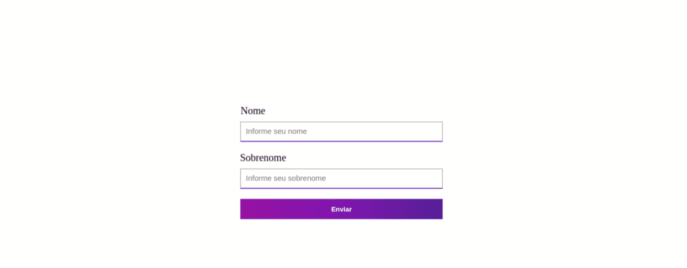

<h1 style="text-align: center">
    
</h1>

<h1>
    
</h1>

### 🧾 Sobre

<p>Esse projeto consiste em demonstrar o quanto o formik nos ajuda a criar formulários em React de forma simples, também funciona para React-native.</p>

---

### 🚀 Tecnologias utilizadas

- React
- Formik

---

### 〽️ Getting started

```zsh
    # Clonando o repositório em sua máquina
    $ git clone https://github.com/edsonjaguiar/formik-react

    # Acessando o repositório
    $ cd formik-react
    
    # Instalando as dependências
    $ yarn

    # Iniciando o server
    $ yarn start
```